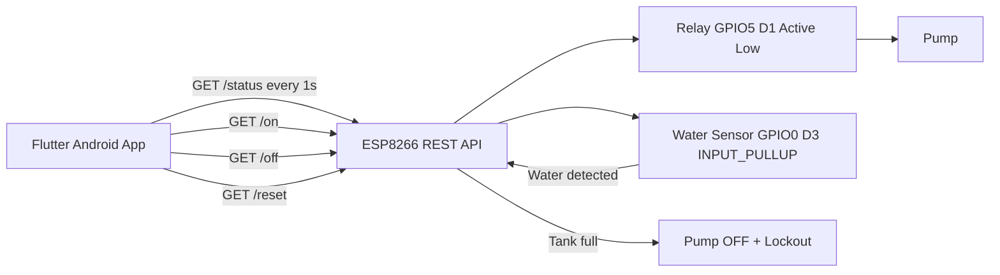

# Water Tank Controller

Wi-Fi connected water tank pump controller using an ESP8266 NodeMCU ESP-12E and a Flutter Android app.

The relay is active low:

- Pump ON: GPIO5 / D1 is LOW
- Pump OFF: GPIO5 / D1 is HIGH

## Features

- Manual pump start and stop from Android
- Tank-full detection on the ESP8266
- Immediate pump shutdown when the tank becomes full
- Lockout state after tank-full detection
- Manual lock clearing from the app
- JSON REST API on the ESP8266
- Material 3 Flutter dashboard
- Polls ESP status every second
- Runtime display in `HH:MM:SS`
- mDNS default address: `http://watertank.local`
- Configurable fallback ESP address
- Local settings persistence
- Network timeout, retry, malformed response, and offline handling

## Architecture Diagram



## Repository Layout

```text
.
|-- pump_automation.ino
|-- android_app/
|   |-- pubspec.yaml
|   |-- android/
|   |-- lib/
|   |   |-- models/
|   |   |-- services/
|   |   |-- screens/
|   |   |-- widgets/
|   |   `-- utils/
|   `-- test/
`-- README.md
```

## ESP Firmware Setup

1. Open `pump_automation.ino` in Arduino IDE.
2. Install ESP8266 board support.
3. Select board: NodeMCU 1.0 ESP-12E Module.
4. Update these constants if needed:

```cpp
const char* ssid = "wifi_name";
const char* password = "password";
const char* mdnsName = "watertank";
```

5. Upload the sketch.
6. Open the serial monitor at `115200` baud.
7. Confirm the printed IP address or use `http://watertank.local`.

## ESP API

`GET /status`

```json
{
  "success": true,
  "wifiConnected": true,
  "pump": false,
  "tankFull": true,
  "lockout": true,
  "runtime": 123
}
```

`GET /on`

Starts the pump only when lockout is not active and tank is not full.

`GET /off`

Stops the pump and resets runtime.

`GET /reset`

Clears lockout and keeps the pump off.

## Flutter Setup

The Flutter app lives in `android_app`.

```powershell
cd android_app
flutter pub get
flutter analyze
flutter test
```

## Build Instructions

Debug run:

```powershell
cd android_app
flutter run
```

APK build:

```powershell
cd android_app
flutter build apk
```

Release APK output is normally created at:

```text
android_app/build/app/outputs/flutter-apk/app-release.apk
```

## Changing ESP Address

1. Open the app.
2. Tap the settings icon.
3. Leave mDNS enabled to use `http://watertank.local`.
4. Disable mDNS to enter a static address such as `http://192.168.1.50`.
5. Save settings.

The app stores the value locally with `shared_preferences`.

## Troubleshooting

- If the app shows `ESP Offline`, confirm the phone and ESP8266 are on the same Wi-Fi network.
- If `watertank.local` does not resolve on Android, switch to a static IP in Settings.
- If START PUMP is disabled, check whether tank-full or lockout is active.
- If lockout is active, press CLEAR LOCK before starting again.
- If the ESP API responds in HTML, upload the updated firmware from this repository.
- If Android blocks HTTP, verify `android:usesCleartextTraffic="true"` is present in `AndroidManifest.xml`.

## Known Limitations

- The app uses the mDNS hostname directly instead of performing a subnet scan.
- The ESP8266 Wi-Fi credentials are still compiled into firmware.
- The generated Android project was created statically because Flutter execution was unavailable in this environment.

## Future Improvements

- Move Wi-Fi setup to captive portal provisioning.
- Add authentication for pump control endpoints.
- Add pump runtime history.
- Add push notifications for tank-full and offline states.
- Add native Android network service discovery for richer mDNS discovery.
